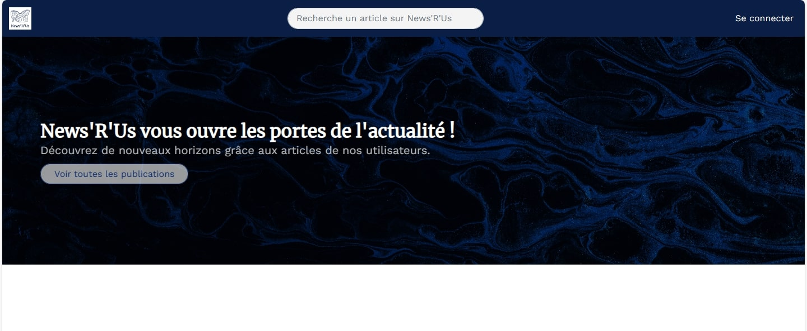
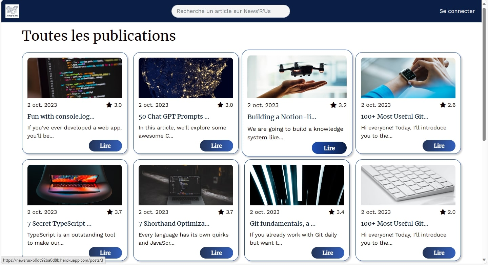
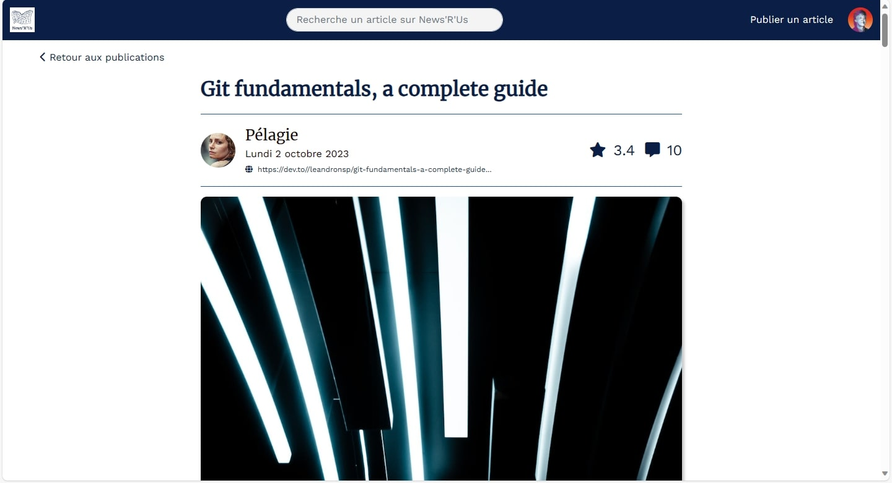
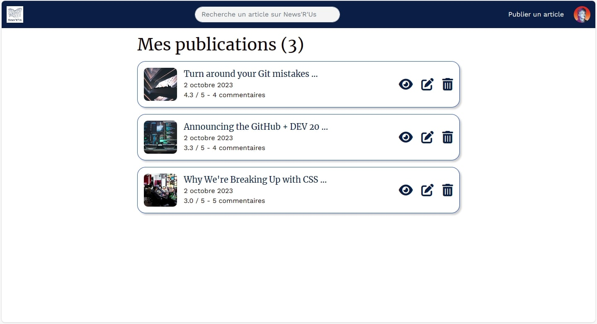

# News'R'Us

Small web application that enables users to read and create posts about actuality. Comments and ratings are available too.

## Autrice

- [@cyrielleiryc](https://www.github.com/cyrielleiryc)

## Captures d'écran

## Demo

https://www.loom.com/share/c2095f3d08ea4918a86277efca619d78?sid=77a80251-815e-406a-98a3-ac7495a8c8f1

## Tech Stack

**Client:** HTML, CSS, JavaScript, Stimulus

**Server:** Ruby, Rails, PostgreSQL
